<div align="center">
  
</div>

<div align="center" style="margin: 20px 0;">
  
</div>

<div align="center" style="margin-bottom: 20px;">
  
</div>

<div align="center" style="display: flex; flex-wrap: wrap; justify-content: center; gap: 10px;">
  
  
  
</div>

<div align="center" style="display: flex; flex-wrap: wrap; justify-content: center; gap: 8px; margin-top: 12px;">
  
  
  
  
</div>

<div align="center" style="margin-top: 8px;">
  <i>Crafting immersive neural experiences through data, sound, and human-centered design.</i>
</div>

---

### 🧠 About Me

```typescript
const navaneeth = {
    identity: {
        name: "Navaneeth K",
        location: "India 🇮🇳",
        status: "Early-Career Computational Neuroscience Researcher"
    },
    
    research: {
        primary: "Brain-Computer Interfaces (BCI) & Neurotech",
        focus: [
            "Neural Signal Processing & EEG Analysis",
            "Audio-Brain Interface Integration",
            "Real-time BCI Applications",
            "Computational Neuroscience Models"
        ],
        interests: [
            "Cognitive Neuroscience",
            "Neural Decoding Algorithms",
            "Closed-loop Brain Stimulation"
        ]
    },
    
    engineering: {
        domains: ["IoT Systems", "Full-Stack Development", "Audio Technology"],
        exploring: ["Edge Computing", "Neural Data Processing", "Embedded Systems"],
        cybersecurity: "CTF Participant & Security Enthusiast"
    },
    
    philosophy: {
        mission: "Building brain-responsive systems for next-gen human-computer interaction",
        vision: "Democratizing neural interfaces through accessible innovation",
        approach: "Bridging neuroscience, technology, and creative problem-solving"
    },
    
    currentWork: [
        "🎧 Audio-driven BCI applications",
        "🧠 EEG signal processing pipelines",
        "🌐 IoT-integrated neural monitoring systems",
        "💻 Full-stack neurotech tools"
    ],
    
    learning: ["Advanced ML for Neuroscience", "Hardware-Software Co-Design", "Signal Processing"],
    openTo: "Research collaborations, innovative projects, and interdisciplinary discussions"
};
```

---

<details open>
<summary><h3>🔬 Research & Technical Expertise</h3></summary>
<br>

#### **Neuroscience & BCI**
<p>


</p>

#### **Programming & Development**
<p>


</p>

#### **AI & Machine Learning**
<p>


</p>

#### **IoT & Embedded Systems**
<p>


</p>

#### **Full-Stack Development**
<p>


</p>

#### **DevOps & Tools**
<p>


</p>

#### **Audio Technology**
<p>


</p>

</details>

---

### 📊 GitHub Analytics

<div align="center">
  
  
</div>

<br>

<div align="center">
  
</div>

---

### 🏆 GitHub Trophies

<div align="center">
  
</div>

---

### 🐍 Contribution Snake Animation

<picture>
  <source media="(prefers-color-scheme: dark)" srcset="https://raw.githubusercontent.com/cyberkunju/cyberkunju/output/github-snake-dark.svg" />
  <source media="(prefers-color-scheme: light)" srcset="https://raw.githubusercontent.com/cyberkunju/cyberkunju/output/github-snake.svg" />
  
</picture>

---

### 🚀 Featured Projects

<div align="center">
  <a href="https://github.com/cyberkunju/Loan-Default-Prediction">
    
  </a>
  <a href="https://github.com/cyberkunju/WayPoint">
    
  </a>
</div>

---

### 🧬 BCI Research Deep Dive

<table align="center">
<tr>
<td width="50%">

#### 🎯 Current BCI Research Areas
- **Non-invasive BCIs**: EEG-based signal acquisition & processing
- **Neural Decoding**: Machine learning for brain state classification
- **Real-time Systems**: Low-latency processing for responsive interfaces
- **Audio Integration**: Exploring auditory-brain coupling mechanisms
- **Neurotech Applications**: Assistive technology & cognitive enhancement

</td>
<td width="50%">

#### 🔬 Tools & Frameworks
- **Signal Processing**: MNE-Python, EEGLAB, FieldTrip
- **ML/DL**: TensorFlow, PyTorch, scikit-learn
- **Hardware**: OpenBCI, Muse, Arduino-based setups
- **Protocols**: LSL (Lab Streaming Layer), Bluetooth LE
- **Visualization**: Matplotlib, Plotly, real-time dashboards

</td>
</tr>
</table>

<details>
<summary><b>📖 Key BCI Concepts & Methodologies</b></summary>
<br>

**Signal Acquisition & Preprocessing**
- EEG electrode placement (10-20 system)
- Artifact removal (EOG, EMG filtering)
- Bandpass filtering & ICA decomposition
- Feature extraction (spectral, time-domain)

**Machine Learning Pipeline**
- Classification algorithms (LDA, SVM, Neural Networks)
- Cross-validation & hyperparameter tuning
- Real-time prediction & feedback loops

**Applications in Development**
- 🎧 Audio-responsive BCI for music interaction
- 🧠 Cognitive state monitoring systems
- 🌐 IoT-integrated neural interfaces
- 💻 Assistive communication devices

</details>

---

### 🎯 Current Focus

```python
class ResearchJourney:
    def __init__(self):
        self.active_research = {
            "primary": "Neural correlates of audio perception",
            "experiments": [
                "Real-time EEG analysis during music listening",
                "BCI control using auditory attention",
                "IoT-neural monitoring integration"
            ]
        }
        
        self.skill_development = [
            "Advanced signal processing (wavelet transforms, time-frequency analysis)",
            "Deep learning for neural decoding (CNNs, RNNs, Transformers)",
            "Hardware interfacing (OpenBCI, custom electrodes)",
            "Real-time systems design & optimization"
        ]
        
        self.building = [
            "🎧 Audio-BCI experimental platform",
            "📊 Neural data visualization toolkit",
            "🌐 Full-stack neurotech web applications",
            "🛠️ Open-source signal processing pipelines"
        ]
        
        self.goals = {
            "short_term": "Publish BCI research findings",
            "medium_term": "Graduate school (computational neuroscience)",
            "long_term": "Advance democratized neural interfaces"
        }
        
        self.open_to = [
            "Research collaborations",
            "Neurotech project partnerships",
            "Academic discussions & mentorship"
        ]
```

---

### 🎓 Academic Interests & Research Goals

<table align="center">
<tr>
<td align="center" width="33%">

#### 🧠 Neuroscience
Neural signal processing<br/>
Cognitive neuroscience<br/>
Neuroplasticity<br/>
Brain dynamics

</td>
<td align="center" width="33%">

#### 🔌 BCI Technology
EEG/fNIRS systems<br/>
Real-time processing<br/>
Closed-loop interfaces<br/>
Neural decoding

</td>
<td align="center" width="33%">

#### 🎵 Audio-Brain Interface
Auditory neuroscience<br/>
Music cognition<br/>
Sound-based BCIs<br/>
Audio DSP integration

</td>
</tr>
</table>

---

### 🔐 Cybersecurity & CTF

<p align="center">
  
  
  
  
</p>

<div align="center">
  <i>Active participant in Capture The Flag competitions | Security researcher | Automation enthusiast</i>
</div>

---

### 📫 Connect With Me

<p align="center">
  <a href="https://cyberkunju.dev">
    
  </a>
  <a href="https://linkedin.com/in/cyberkunju">
    
  </a>
  <a href="https://cyberkunju.online">
    
  </a>
  <a href="https://github.com/cyberkunju">
    
  </a>
</p>

<p align="center">
  <i>💡 Open to research collaborations, neurotech projects, and innovative ideas</i>
</p>

---

### 💡 Random Dev Quote

<div align="center">
  
</div>

---

<div align="center">
  
</div>

<div align="center">
  <i>⚡ Bridging minds and machines through code, science, and curiosity ⚡</i>
</div>

***

## 🔧 Setup Instructions for Advanced Features

### 1. Snake Animation Setup[2][1]

Create `.github/workflows/snake.yml`:

```yaml
name: Generate Snake Animation

on:
  schedule:
    - cron: "0 */12 * * *"
  workflow_dispatch:
  push:
    branches:
    - main

jobs:
  generate:
    permissions:
      contents: write
    runs-on: ubuntu-latest
    timeout-minutes: 5

    steps:
      - name: Generate github-contribution-grid-snake.svg
        uses: Platane/snk/svg-only@v3
        with:
          github_user_name: ${{ github.repository_owner }}
          outputs: |
            dist/github-snake.svg
            dist/github-snake-dark.svg?palette=github-dark&color_snake=#00d9ff&color_dots=#161b22,#0e4429,#006d32,#26a641,#39d353

      - name: Push github-contribution-grid-snake.svg to output branch
        uses: crazy-max/ghaction-github-pages@v3.1.0
        with:
          target_branch: output
          build_dir: dist
        env:
          GITHUB_TOKEN: ${{ secrets.GITHUB_TOKEN }}
```

### 2. Blog Post Automation[4]

Create `.github/workflows/blog-post-workflow.yml`:

```yaml
name: Latest Blog Posts
on:
  schedule:
    - cron: '0 */6 * * *'
  workflow_dispatch:

jobs:
  update-readme-with-blog:
    name: Update README with latest blog posts
    runs-on: ubuntu-latest
    steps:
      - name: Checkout
        uses: actions/checkout@v2
      - name: Pull in blog posts
        uses: gautamkrishnar/blog-post-workflow@v1
        with:
          feed_list: "https://yourblog.hashnode.dev/rss.xml,https://medium.com/@yourusername/feed"
          max_post_count: 5
          template: "$newline- $randomEmoji(💡,🚀,🧠,🔬,⚡,🎯) [$title]($url) $newline"
```

### 3. GitHub Metrics[5]

Create `.github/workflows/metrics.yml`:

```yaml
name: Metrics
on:
  schedule: [{cron: "0 0 * * *"}]
  workflow_dispatch:
  push: {branches: ["main"]}

jobs:
  github-metrics:
    runs-on: ubuntu-latest
    permissions:
      contents: write
    steps:
      - uses: lowlighter/metrics@latest
        with:
          token: ${{ secrets.METRICS_TOKEN }}
          user: yourusername
          template: classic
          base: header, activity, community, repositories, metadata
          config_timezone: Asia/Kolkata
          
          plugin_isocalendar: yes
          plugin_isocalendar_duration: full-year
          
          plugin_languages: yes
          plugin_languages_limit: 12
          plugin_languages_sections: most-used
          plugin_languages_colors: github
          plugin_languages_details: percentage
          
          plugin_notable: yes
          plugin_notable_types: commit
          
          plugin_habits: yes
          plugin_habits_charts: yes
          plugin_habits_days: 30
          plugin_habits_facts: yes
          plugin_habits_from: 500
          
          plugin_followup: yes
          plugin_followup_sections: repositories
```

### 4. WakaTime Integration[5]

Add to your README where you want coding stats:

```markdown
### ⏱️ Weekly Development Breakdown

<!--START_SECTION:waka-->
<!--END_SECTION:waka-->
```

Create `.github/workflows/waka-readme.yml`:

```yaml
name: Waka Readme

on:
  workflow_dispatch:
  schedule:
    - cron: "0 0 * * *"

jobs:
  update-readme:
    name: WakaReadme DevMetrics
    runs-on: ubuntu-latest
    steps:
      - uses: athul/waka-readme@master
        with:
          WAKATIME_API_KEY: ${{ secrets.WAKATIME_API_KEY }}
          SHOW_TITLE: true
          BLOCKS: ⣀⣄⣤⣦⣶⣷⣿
          TIME_RANGE: last_7_days
          SHOW_TIME: true
          SHOW_MASKED_TIME: true
```

***

### 📝 Key Customizations

Replace in the README :[3]
- `yourusername` → Your GitHub username
- `Your Name` → Your actual name
- Repository names in Featured Projects section
- Social media links in Connect section
- Email address
- Blog RSS feed URLs

The design features :[1][2][3]
- **Gradient animated header/footer** with twinkling effects
- **Multi-line typing animation** with 5 rotating titles
- **Tokyo Night theme** with custom cyan (#00D9FF) accent color
- **Snake contribution animation** with custom cyan snake
- **Comprehensive tech badges** covering neuroscience, BCI, IoT, and full-stack
- **Dynamic GitHub stats** with matching theme
- **Collapsible sections** for clean organization
- **Professional code blocks** showcasing expertise
- **CTF and security** emphasis section
- **Academic focus table** highlighting research areas

This README positions you as an elite researcher-engineer at the intersection of neuroscience, BCI technology, and software development with exceptional visual appeal and automation.[6][4][5]

[1](https://github.com/marketplace/actions/generate-snake-game-from-github-contribution-grid)
[2](https://github.com/Platane/snk)
[3](https://github.com/DenverCoder1/readme-typing-svg)
[4](https://hasnainm.hashnode.dev/revamp-your-github-profile-the-ultimate-2025-readme-template-guide)
[5](https://github.com/lowlighter/metrics)
[6](https://github.com/abhisheknaiidu/awesome-github-profile-readme)
[7](https://www.youtube.com/watch?v=U-IVndCqXWc)
[8](https://www.linkedin.com/pulse/how-add-github-contribution-snake-your-profile-readme-chan-meng-tzakc)
[9](https://dev.to/annavi11arrea1/github-page-aesthetics-and-fun-snake-stats-icons-and-videos-1dd7)
[10](https://github.com/yoshi389111/github-profile-3d-contrib)
[11](https://github.com/orgs/community/discussions/74444)
[12](https://github.com/marketplace/actions/github-profile-3d-contrib)
[13](https://readme-typing-svg.herokuapp.com)
[14](https://github.com/topics/github-contribution-graph)
[15](https://www.youtube.com/watch?v=EVKkJRZMacM)
[16](https://serverlesstalent.com/project/readme-typing-svg_by_DenverCoder1)
[17](https://www.youtube.com/watch?v=eHaXw8Bd_ms)
[18](https://github-contributions.vercel.app)
[19](https://github.com/topics/readme-typing-svg)
[20](https://docs.github.com/articles/viewing-contributions-on-your-profile-page)
[21](https://publicapi.dev/readme-typing-svg-api)
[22](https://stackoverflow.com/questions/14507778/github-contributions-graph)
[23](https://jonahlawrence.hashnode.dev/create-and-elevate-your-github-profile-readme)
